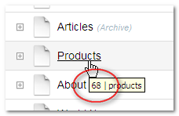
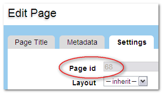

Functions
=========

The "functions" section houses pages that provide more detailed information about individual functions of Wolf CMS. These pages serve as an additional source of information on top of the PHPDoc references. These function pages may be out of date since they are manually maintained.

author()
--------

Wolf saves the id of the user who creates a page, and the name for that id can be displayed using author(). This is commonly given in the page's “meta”, for example:

```
	<p class="meta">Posted by <?php echo $this->author(); ?></p>
```

Also see: [updater()](functions.md#updater).

authorId()
----------

Wolf saves the unique id number of the user who creates a page, and that id number can be accessed using `authorId()`. This might be especially useful if two "authors" registered on the system have the same name. For example:

```
	<?php if ($this->authorId() == '1') {
		// do things
		} else {
		// do something else
		}
	?>
```

This would be a more reliable test than one using the `author()` function (which returns the name) if two users were both registered with same name.

Also see: [updaterId()](functions.md#updaterid).

breadcrumb()
------------

When a page is created in Wolf, the “Breadcrumb” value is automatically completed with the same values as the page title itself. This is the page reference used automatically by the breadcrumbs function, but it can also be used on its own:

```
	<?php echo $this->breadcrumb(); ?>
```

The "Breadcrumb" field is found under the "Metadata" tab next to the "Page Title" tab, and the value can be edited.[^1] It may be, for example, that a very long page title could be abbreviated for use as a "breadcrumb". Once edited, and different from the Page Title, its value will remain unchanged even if the Page Title itself is changed.

[^1]: It can be used, then, as a secondary “page title” field.

breadcrumbs()
-------------

"breadcrumbs" can be created in Wolf by adding this code to a Layout:

```
	<?php echo $this->breadcrumbs(); ?>
```

By default, it produces output of this kind:

> *Home > Music > Baroque > Bach*

In order to change the value of the separator, include it as a parameter. If for example, you wish to use a forward slash:

```
	<?php echo $this->breadcrumbs('/'); ?>
```

Any character may be used this way.

!!! note
    If you wish to use a backslash, it must be given twice, since it is a PHP escape character:

    ```
      <?php echo $this->breadcrumbs('\\'); ?>
    ```

children()
----------

`children()` returns an array of values relating to the child pages of the current page.[^2] Normally, then, it is not used on its own, but to give some information about published subpages to a given page.

The array produced by `children()` requires a foreach loop to present usable information. The most simple listing of subpage titles, then, could look like this:

```
	<h3>List of pages</h3>

	<ul>
		<?php  foreach ($this->children() as $child) : ?>
		<li><?php echo $child->title(); ?></li>
		<?php endforeach; ?>
	</ul>
```

In situations when in return only a single result is desired, the foreach loop should be ditched in favor of `limit ⇒ 1` argument (see Arguments below in this page), otherwise it will not work and a fatal error is returned instead. The example below returns the last published page from Articles as the parent page.

```
	<?php
	  $page_article = $this->find('/articles/');
	  $last_article = $page_article->children(array('limit'=>1, 'order'=>'page.created_on DESC'));
	?>
		<h2 class="post_title"><?php echo $last_article->link(); ?></h2>
		<?php echo $last_article->content(); ?>
		<?php if ($last_article->hasContent('extended')) echo $last_article->link('Continue Reading&#8230;'); ?>
```

For further information on how to use `children()` in constructing menus, see how to Display a list of subpages.

### Conditions

#### Including hidden pages

By default, `children()` only returns "published" pages.[^3] In the following line of code, the final `true` tells Wolf to include hidden pages as well:

```
	$this->children(null,array(),true)
```

#### Additional arguments

Four more arguments can be given to `children()` to further define the subpages it returns:

* `where` &mdash; Sets a condition.
* `order` &mdash; Determines the sort order by field name in page table [see note below], either ASC ascending, or DESC descending.
* `offset` &mdash; Where in the list of subpages to begin the list.
* `limit` &mdash; How many pages to return.

!!! note
    Any of the fields in the page table can be used to sort your "children" pages. In first example, below, you could have:

    `'order' => 'title ASC'`

    to arrange the order by the page Title in A-Z order, or

    `'order' => 'slug DESC'`

    to order the list by “slug” value in Z-A order. That should give you the idea! While any value in the “page” table could be used here, the main options would include:

    * title
    * slug
    * breadcrumb
    * created_on
    * published_on
    * updated_on
    * created_by_id
    * updated_by_id

    The default is *position*, which is set automatically when the drag-drop page re-ordering is used.

[^2]:	Consult the documentation on `$this->` to find out what the “current” page is in different situations.

[^3]:	Consult the documentation on creating a page for a full list of page-status definitions.

childrenCount()
---------------

The `childrenCount()` function returns a count of how many child pages belong to the current page. A simple `echo $this->childrenCount();` will return the number of “published” pages to the current page.

`childrenCount()` can be useful, then, for determining when to include navigation, for example:

```
<?php if ($this->childrenCount() > 0) {
    // if count is > 0, there are child pages, so do stuff
	} else {
		// no child pages, so do something else
	}
?>
```

It takes the same parameters as the [children()](functions.md#children) function.

content()
---------

As its name suggests, the `content()` function returns the content of pages created in Wolf. More specifically, it returns the content of the page-part given as a parameter; if no parameter is given, then it defaults to the body page-part, circled in red in this graphic:

<p align="center"></p>

In order to display the body, put this code at the appropriate place in your layout:

```
	<?php echo $this->content(); ?>
```

Other content parts (page-parts) can be created by clicking the green "+" icon above the upper-right corner of the page editing box. (The red "-" icon deletes the active part/tab, so be careful!)

<p align="center"></p>

If you need to display one of these "custom" parts, like the sidebar tab in the Home Page graphic above (circled in blue), just add it to the parameter:

```
	<?php echo $this->content('sidebar'); ?>
```

!!! note
    If you use `<?php echo $this->content(); ?>` in page content, it will create an infinite loop: so don’t do it! In other words, only use that code for the page body tab in a Layout, not in a Page.

### "Inheriting" content

In order for the “part” to be inherited by "child" pages (and "child-of-child" pages, etc.), use the true parameter:

```
<?php $this->content('sidebar', true); ?>
```

!!! note
    If the current page has its own equivalent "sidebar" part, then that will prevent the “inheritance” from the parent page from taking place.

### Displaying the content of one page on a different page

If you want to call the content from a some page onto a different page, you must use the [find()](functions.md#find) function in conjunction with [content()](functions.md#content). For example, to display the content of the default “About us” page on any other page, use this code:

```
<?php echo $this->find('about_us')->content(); ?>
```

date()
------

To display the date a page was created, use:

```
<?php echo $this->date(); ?>
```

If you want to change the format of the date, you can pass it as the first parameter of the method like this:

```
<?php echo $this->date('%A, %e %B %Y'); ?>
```

For more information about the date format, check the PHP manual for `strftime` at [http://php.net/strftime](http://php.net/strftime)

!!! note
    On Windows, and rarely in other settings, the use of %e may prevent any date appearing! In this case, use %d in its place. (See PHP Bugs for more information, the date howto for a work-around.)

### Values

The default date returned is the page’s creation date. The dates which can be displayed are:

* `created` — (default) which returns the date the page was initially stored in the database, no matter what "Status" it had;
* `published` — which returns the date the page was first saved with the “Status” set to "Published"; and
* `updated` — which returns the most recent date on which that page was altered (this can include re-ordering)

### Example

For example, if you want to display the last updated time of this page, use this:

```
	<?php echo $this->date('%a, %e %b %Y', 'updated'); ?>
```

### How to translate every date in your layout

Set the locale to your language with the *setlocale* PHP function:

```
	<?php setlocale(LC_ALL, 'fr_CA.utf8'); ?>
```

For more information about this function, consult the PHP manual on `setlocale` at [http://php.net/setlocale](http://php.net/setlocale)

description()
-------------

In editing a page, under the **Metadata** tab is the “Description” field which makes use of the `description()` function. The default Layout includes this line in the `<head>…</head>` section:

```
	  <meta name="description" content="<?php echo ($this->description() != '') ? $this->description() : 'Default description goes here'; ?>" />
```

This checks to see if there is any Metadata filled in for the page, and if there is, it is used. Otherwise, the default text is used.

executionTime()
---------------

The `executionTime()` function returns the time in seconds it takes for the page to be rendered. It can be called this way:

```
	<?php echo $this->executionTime(); ?>
```

When `DEBUG` is defined as `true` in `config.php`, this information is also reported in the footer of the admin pages.

find()
------

The `find()` function can be used to find and retrieve Page objects. As such, it needs a value to search on, either a **slug** value or a variable. It returns a Page object which has further functions to retrieve page information (or an array of information, depending on which of the object's function you use). A simple example:

```
	<?php
		$pageobject = $this->find('/about-us');
		echo $pageobject->link();
	?>
```

You can also directly access the object's (in this case) `link()` function with a short hand notation. This prevents you from first having to assign the result of the `find()` function to a variable before accessing the object's functions. A simple example:

```
	<?php echo $this->find('/about-us')->link(); ?>
```

These two examples are functionally the same and produce the following HTML from anywhere in the site:

```
<a href="http://www.mywolfsite.com/about_us">About us</a>
```

For the **main** level of navigation, `find()` does not need forward-slashes. All of these will produce the same result:

* `$this->find('/about-us')`
* `$this->find('/about-us/')`
* `$this->find('about-us')`

`find()` can be used in conjunction with most (probably all!) of Wolf's other functions, not just "link", as in the example above.

### Examples

#### Finding pages at Level 2

When looking for child-of-child pages *(That is, pages at level “2”; see the `level()` documentation for explanations of levels)*, both terms need to be given:

* **hard** set: `$this->find('fruit/apples');`
* using variables: `$this->find($parent.'/'.$subpage);`

Note that the `getUri()` function gives all slugs for a page, including the slugs of all ancestor pages.

#### Using variables

The value of the search term can be contained in a variable. For example, the conditional navigation in the “Wolf” default layout finds a variable, $parent, which is the current top-level navigation page. Using this value in conjunction with the "children" function produces a dynamic listing of child-pages, giving a simple menu:

```
	<?php // simplified code:
		$topPage = $this->find($parent);
	?>

	<ul>
	<?php foreach ($topPage->children() as $subPage) : ?>
		<li><?php echo $subPage->link(); ?></li>
	<?php endforeach; ?>
	</ul>
```

findById()
----------

The `findById()` function allows you to retrieve a set of page objects using a page's id as the search term. *(See the [id()](functions.md#id) documentation on how to find the ID of any given page.)* This function works in the same way as the [find()](functions.md#find) function; consult its entry for more discussion.

Also see: [linkById()](functions.md#linkbyid) and [urlById()](functions.md#urlbyid) gives information about using a variable for the ID.

### Example

You can use the id of page to construct a basic menu of child pages. This can be helpful in cases where the slugs or location of a parent page might change (“4” is the id of the “articles” page in a default installation of Wolf):

```
	<?php $children = $this->findById(4)->children(); ?>
	<ul>
	  <?php foreach ($children as $child) : ?>
	  <li><?php echo $child->link(); ?></li>
	  <?php endforeach; ?>
	</ul>
```

getUri()
--------

This function will return the **slug values** which point to a given page.

### Notes

For this code: `<?php echo $this->getUri(); ?>`, note the different results:

1. for URL: http://www.wolfsite.com/
    * `getUri()` = [nothing]
2. for URL: `http://www.mysite.com/wolf/` (when installing Wolf CMS in a subdirectory 'wolf')
    * `getUri()` = [nothing]
3. for URL: `http://www.wolfsite.com/about_us`
    * `getUri()` = about_us
4. for URL: `http://www.wolfsite.com/about_us.html`
    * `getUri()` = about_us
5. for URL: `http://www.wolfsite.com/articles/2009/11/10/my_first_article`
    * `getUri()` = articles/my_first_article

Note in the last example that only the **slug** values are given, not the **yyyy/mm/dd** values generated by the **Archive plugin**. For this page behaviour, compare the related "constant", CURRENT_URI.

### Examples

#### Finding "top slug" for page tree

It is often useful to find the slug of the top (level 1) page in a tree. This can be using for conditional navigation, or setting a unique background or banner for that area of the site, etc. The most simple code for this can use the `getUri()` function:

```
	<?php
		// Returns the top parent slug:
		$topParent = reset(explode('/', $this->getUri()));
	?>
```

For the URI of `fruit/apples/granny-smith` with the code above, then `echo $topParent;` would return `fruit`.

#### Get list of "sibling" pages

If one wanted a list of “sibling” pages (at same level, with same parent), you wouldn't know in advance how many slugs were needed in the find-> statement, so here again `getUri()` should be used. The following code (to be used in a Layout) produces a simple sibling list of this kind:

* Sibling1
* Sibling2
* Sibling3

```
	<?php if ($this->level() > 0) : ?>
	<ul>
	<?php foreach ($this->find($this->parent->getUri())->children() as $sibling) : ?>
		<?php if ($this->slug() != $sibling->slug()) : ?>
	<li><?php echo $sibling->link(); ?></li>
		<?php endif; ?>
	<?php endforeach; ?>
	</ul>
	<?php endif; ?>
```

!!! note
    Note that the code as given omits the current page. To include all sibling pages, including the current page, remove the “inner” if/endif statements (lines 4 and 6).

hasContent()
------------

The `hasContent()` function may be thought of as the conditional counterpart of the `content()` function *(See the [content()](functions.md#content) function entry for a more complete explanation.)*

It can take two parameters:

* A page-part must given as the first parameter. If it is found, the function returns **true**, otherwise it returns **false**.
* Like `content()`, the `hasContent()` function can also be inherited by setting the second parameter to **true** (optional); by default this is set to **false**.

### Examples

Again, like `content()`, this function relates to a given object, and so is used like this:

```
	<?php echo $this->hasContent('page-part') ? $this->content('page-part'): ''; ?>
```

For the page-part to be inherited by all descendant pages, use:

```
	<?php echo $this->hasContent('page-part') ? $this->content('page-part', true): ''; ?>
```

!!! note
    **Version notes**

    *< 0.6.0*

    In versions up to and including 0.6, the name does not quite match the operation of this function: it does not test to see if “page-part” has any content, and then echoes it if there is some text there. Rather, it checks to see if there is a “page-part”, and then echoes whatever is there.

    In other words, this function tests to see if a part exists, and will return “true” even if the part is there with no content at all.

    *0.7.0+*

    With the introduction of the `partExists()` function, `hasContent()` now behaves as expected by the name: it checks to see if the part exists and if that part contains any content.

id()
----

The `id()` function returns the database ID of the current page. This code:

```
	<?php echo $this->id(); ?>
```

will return a number, e.g. “1” for the root page (“Home page”) created at install time.

!!! note
    Note that for Archive pages, (e.g., the %B %Y archive monthly archive page created during installation), the `id()` result will be the same no matter which month (in this example) is being displayed, since each one is the same “page”.

### Finding the ID of a page

To discover the ID of any page (“68” in the examples below), either *(a)* hover over the title in the Pages index, and the page id and slug will be displayed in a tooltip:

<p align="center"></p>

or *(b)* click the **Settings** tab when editing the page:

<p align="center"></p>

includeSnippet()
----------------

This function is used to include **snippets** in Wolf pages. The syntax is:

```
	<?php $this->includeSnippet('the_name_of_the_snippet'); ?>
```

On the way the special PHP variable `$this->` behaves when used in a snippet, see the documentation for `$this->`.

Snippets may call/include other snippets.

From **0.7.0** the `includeSnippet()` function will return **true** if the snippet name is found, but **false** if the snippet name does not exist. If a test is used which evaluates `includeSnippet()` as **true**, the value of the snippet will be passed automatically.

### Hints

#### Conditional Use of Snippets

You could also create a snippet with your php code, then only include it on the relevant page by using a conditional statement. That way you won't need a page-part, and it's only a small addition to your layout:

```
	<?php // only include on contact page or children
		if(url_start_with('/contact'))  $this->includeSnippet('the_name_of_the_snippet');
	?>
```

Just keep in mind that it will also be included in any children pages, because it's looking for a url that begins with the provided text.

keywords()
----------

In editing a page, under the Metadata tab is the “Keywords” field which makes use of the keywords function. The default Layout includes this line in the `<head>…</head>` section:

```
<meta name="keywords" content="<?php echo ($this->keywords() != '') ? $this->keywords() : 'default, keywords, here'; ?>" />
```

This checks to see if there are any keywords filled in for the page, and if there are, they are used. Otherwise, the default text is used.

level()
-------

`level()` refers to the “distance” of a page in the tree from Home Page or, more precisely, the number of elements a given page is distant from the “root” in the URI. “Home Page” (or “root” in the URI) is at zero.

You can echo the level of a page to the screen using this code:

```
	<?php echo $this->level(); ?>
```

### Examples

| In this URI                             | this page     | is at this level |
| --------------------------------------- | ------------- | ---------------- |
| http://www.example.com/                 | (home page)   | 0                |
| http://www.example.com/wolf/            | (home page)   | 0                |
| http://www.example.com/about-us.html    | about-us.html | 1                |
| http://www.example.com/about-us/contact | contact       | 2                |


It is **important to note** that the “archive” (“blog”) type pages work this way:

| In this URI                                        | this page | is at this level |
| -------------------------------------------------- | ----------| ---------------- |
| http://www.example.com/articles                    | articles  | 1                |
| http://www.example.com/articles/2009/03/07/my-news | my-news   | 5                |
| http://www.example.com/articles/my-news            | my-news   | 5                |

!!! note
    In an “archive” setting, the level of my-news is always 5, even though it is the child of the articles page which is at level 1.

#### Usage note

`level()` is very useful in a test to keep things off the “Homepage” that should only appear “inside” the site:

```
	<?php if ($this->level() != 0) : ?>
	... do stuff inside the site, but not on the Homepage ...
	<?php endif; ?>
```

The `if()` test checks to see if the level is **not** '0' (= homepage), and if not, whatever appears before the `endif` will be run.

link()
------

The `link()` function by default produces the title of the current page wrapped in HTML hyperlink tags For example, in an out-of-the-box Wolf install, for the “About Us” page, this code:

```
	<?php echo $this->link(); ?>
```

produces:

```
<a href="http://www.mywolfsite.com/about_us">About us</a>
```

#### Arguments

`link()` can take two arguments: the first to give the title for the link (so overriding the default page title), the second can be used for other link parameters.

Also see: [linkById()](functions.md#linkbyid)

##### Link with different text

Assuming that “About Us” is still the “current” page, then this code:

```
	<?php echo $this->link('Click here!'); ?>
```

will produce this link:

```
	<a href="http://www.mywolfsite.com/about_us">Click here!</a>
```

##### Link with Title text, adding parameter

To retain the default title, but add a further parameter, this code:

```
	<?php echo $this->link($this->title, ' class="info"'); ?>
```

will produce this link:

```
	<a href="http://www.mywolfsite.com/about_us" class="info">About us</a>
```

!!! tip
    To produce links of pages other than the current one, see the [find()](functions.md#find) function.

linkById()
----------

This function makes it possible to create a “persistent link” to a page, so that the link will not break even if the page is moved to a different location in the page hierarchy. It has the same options as the link function (see that page for explanations and examples). The page ID is used as the basis for the link, rather than the page's “slug”.

Also see: [findById()](functions.md#findbyid), [urlById()](functions.md#urlbyid).

### Usage

```
	<?php echo Page::linkById(3); ?>
```

or

```
	<?php echo $this->linkById(3); ?>
```

where “3” in the example above is the “id” of the targetted page.

To find out what the ID of a given page is, either look on the “metadata” tab, or hover above the page's title or icon in the main admin page listing, where the ID will appear as a tooltip.

#### Using a variable for the ID

Using a simple variable for the ID may not pass the filter test set by the `linkById()` function, since the variable might be a “string” rather than an “integer”, which is what this function requires. In other words, something like this:

```
	<?php echo Page::linkById($article->id()); ?>
```

might throw an error. It is possible to set the ID number dynamically, but it might require an extra step, wrapping the variable for the ID in with the PHP `intval()` function, like this:

```
	<?php
		$articleId = intval($article->id());
		echo Page::linkById($articleId);
	?>
```

Another more compact solution uses PHP (int) to cast the value as an integer:

```
	<?php
		echo Page::linkById((int)$article->id());
	?>
```

With either of these solutions in place, the `linkById()` function will work as expected.

next()
------

Wolf provides a simple `previous()` and `next()` function. next returns an array of values relating to the page following the current page, if it exists. It is thus not used on its own, but normally would be used in the Layout to provide a link to the **next* page.

### Example

The following code tests to see if a **next** page exists. If it does, it makes a link accompanied by a label with a double-arrow pointing right:

```
	<?php if ($next = $this->next()): ?>
	  <div style="float: right; border-top: thin solid #ccc; padding-top: 4px;">Next &#187; <?php echo $next->link(); ?></div>
	<?php endif; ?>
```

Also see: [previous()](functions.md#previous)

odd_even()
----------

This simple function returns either **odd** or **even** (in that order) in turn. This helps especially in the production of tables, or in any case where alternating values need to be produced.

For example, used in a foreach loop of this kind (note the “class” in the paragraph tag):

```
	<?php foreach ($articles as $article): ?>
	  <p class="<?php echo odd_even(); ?>"><?php echo $article->title(); ?></p>
	<?php endforeach; ?>
```

the `odd_even()` function would produce this output:

```
	<p class="odd">Yesterday</p>
	<p class="even">Penny Lane</p>
	<p class="odd">Help!</p>
	<p class="even">Eleanor Rigby</p>
	...
```

This function has an alias as `even_odd()` which produces identical output.

parent()
--------

`parent($level)` returns an array of values relating to the parent page of the current page. Normally, then, it is not used on its own, but to give some information about the parent page.
Using the `$level` parameter

`$level` must be initialized properly if it is to be used:

* If you do NOT supply `$level`, you simply get the parent object.
* If `$level > $this->level()`, you get **FALSE**.
* If `$level == $this->level()`, you get `$this` returned.
* Otherwise it tries the above tests with the parent object.

Thus, if a value is given for `$level`, it should be one of: null, equal-to-current-level, or greater-than-current-level.
Examples

For the following tree of pages:

```
	Home Page
	  |
	  |- Hickory
	  |    |
	  |    |- Dickory
	  |    |
	  |    |- Dock
	  |
	  |- Clock
```

* when Clock is the current page, then:
	* `$this->parent()->title()` returns **Home Page**
	* `$this->parent()->slug()` returns **' '** (i.e., null)
	* `$this->parent()->level()` returns **0**
* when Dock is the current page, then:
	* `$this->parent()->title()` returns **Hickory**
	* `$this->parent(2)->title()` returns **Dock** (this page is at level 2)
	* `$this->parent()->slug()` returns **hickory**
	* `$this->parent()->level()` returns **1**
	* etc. …
* when Home Page is the current page, then:
	* `$this->parent()->ANYTHING` returns an **ERROR** (do not use it!)

partExists()
------------

The `partExists()` function is related to the `hasContent()` function, and tests for the simple presence of a specified page-part.

It can take two parameters:

* A page-part must given as the first parameter. If it is found, the function returns **true**, otherwise it returns **false**. These results are returned whether or not the page-part actually contains any content.
* Like the `content()` and `hasContent()` functions, `partExists()` can also be inherited by setting the second parameter to **true** (optional); by default this is set to **false**.

### Usage

```
	<?php if ($this->partExists('page-part')) {
	  // do something if the part exists = true
	} else {
	  // do something else if the part does not exist = false
	}; ?>
```

For more detail, see `hasContent()`.

previous()
----------

Wolf provides a simple `previous()` and `next()` function. previous returns an array of values relating to the page preceding the current page, if it exists. It is thus not used on its own, but normally would be used in the Layout to provide a link to the “preceding” page.

### Example

The following code tests to see if a “previous” page exists. If it does, it makes a link accompanied by a label with a double-arrow pointing left:

```
	<?php if ($previous = $this->previous()): ?>
	  <div style="float: left; border-top: thin solid #ccc; padding-top: 4px;"><?php echo $previous->link(); ?> &#171; Previous</div>
	<?php endif; ?>
```

Also see: [next()](functions.md#next)

slug()
------

The slug is the form of the page's title used in the URL. It is produced by Wolf automatically when the page is created. For example, the “slug” for the “Articles” page is articles. Spaces are converted to hyphens: the title “Rhythm and Blues” will produce the slug `rhythm-and-blues`.

This value can be changed manually by editing it directly. When editing a page, click on the “Metadata” tab; “Slug” is the first field you see.

The slug of a given page can be retrieved with:

```
	<?php echo $this->slug(); ?>
```

!!! note
    * Home Page has no slug, not ever. For this reason, Wolf CMS does not offer a “slug” field in the metadata area of the root page.
    * Since the “slug” is used to form the page's URL, be careful which characters you use.
    * If the value of the slug is manually edited, it will retain the manually-edited value, even if the title of the page is changed.
    * If you wish to get the slug of a page with the slugs of all its ancestor pages, use the :ref:`getUri()` function.

### Example

#### find()

The `find()` function uses the slug value to find a page. To find the Articles page, use `$this->find('/articles/')`.
Using the slug in conditions

The slug is the best value to use if you want to ensure that code is used on a certain page, or to prevent some code from executing on a given page. For example, if you want to prevent some code from running on your “blog”-type pages (Articles), you could use something like this:

```
	<?php if ($this->slug() != 'articles') {
	  // do stuff you want to happen on all pages but the articles page
	  code ... code ... code;
	} ?>
```

tags()
------

`tags()` produces an array of the tags which have been entered in the **tags** field under the Metadata tab when editing a page.

### Usage

Wolf's default installation gives a simple demonstration of a list of tags in the “Articles” page, where the following line is included:

```
	tags: <?php echo join(', ', $article->tags()); ?>
```

This shows you how to turn the `tags()` array into string, and this can then be used for other purposes.

### Plugin

The most obvious way of handling tags is by using the [Tagger](https://github.com/silentworks/tagger) plugin which is under active development. Its growing feature set allows for a range of tag-management and usage options.

### Example

#### Subpages filtered by tag

If you wanted to give the list of subpages to a parent page, based on the presence of a particular tag, you could do it this way:

```
	<?php $findTag = 'hello'; // REPLACE hello WITH THE TAG YOU WANT TO FIND ?>
	<h3>Pages with the tag "<?php echo $findTag; ?>":</h3>
	<ul>
	<?php foreach ($this->children() as $child): ?>
	<?php $childTags = join(',', $child->tags()); ?>
	  <?php if (strpos($childTags, $findTag) !== FALSE) : ?>
		<li><?php echo $child->link(); ?></li>
	  <?php endif; ?>
	<?php endforeach; ?>
	</ul>
```

You manually enter the tag you want to find (“hello” is used in the example above), which is echoed in a heading to your list of pages. Then the foreach loop finds the child pages, while the strpos test filters those pages with the desired tag, which is then output to an unordered list. Include that block of code on the parent page, **ensuring that the page's text filter is not TinyMCE**, which does not cope with PHP!

Although this code is for use on a “parent” page to find a certain tag-term among its child pages, it could be modified to look in other “branches” of the site, or to look through deeper levels.

$this->
-------

Properly speaking, this is not a “Wolf” function at all. PHP uses a special variable, `$this->`, which always points to the “current object”. But what is the “current object”? In Wolf, the meaning of `$this->` depends on where you use it. Here is it how works:

* in the Layout, `$this->` points at currently displaying page, whatever it is.
* in the Body of page, `$this->` points at that page only.
* in a Page-part, `$this->` points at the page to which that part belongs — even if it is “inherited” by child pages with the **true** condition as in:

	* `<?php $this->content('sidebar', true); ?>`
	* For example, if the “sidebar” of “Homepage” uses `$this->`, and that sidebar is inherited by child pages, then `$this->` still refers to the homepage.

* in a Snippet, `$this->` will behave as outlined above, depending on whether you call the snippet in your layout, in the body of a page, or in a page-part.

That can be summarized in a table as follows:

| If `$this->` appears in | then `$this->` points to                       |
| ----------------------- | ---------------------------------------------- |
| Layout                  | currently displayed page                       |
| Body of page            | that specific page **only**                    |
| Page-part (tab)         | the owning page **only**                       |
| Snippet                 | as above, depending on where snippet is called |

title()
-------

The `title()` function returns the title of the current page. This code:

```
	<?php echo $this->title(); ?>
```

will return the text found in the “Page Title” field, prominently displayed when editing a page.

### Notes

This function does not take any parameters, but it can be used in conjunction with the `find()` function to display the title of a page that is not current.

Another example of its use can be found in “header” snippet for the Simple layout to generate Wolf's main navigation:

```
	<li><?php echo $menu->link($menu->title, (in_array($menu->slug, explode('/', $this->url)) ? ' class="current"': null)); ?></li>
```

updater()
---------

Wolf saves the id of the user who updates a page, and the name for that id can be displayed using `updater()`. This is sometimes given in the page's “meta”, for example:

```
	<p class="meta">Updated by <?php echo $this->updater(); ?></p>
```

Also see: [author()](functions.md#author)

updaterId()
-----------

Wolf saves the unique id number of the user who updates a page, and that id number can be accessed using `updaterId(). For notes on usage, see the [authorId()](authorid) function page.

url()
-----

The `url()` function gives access to the URL of the current page. It does not take any parameters. If, for example, the current page was the “Articles” page, then

```
	<?php echo $this->url(); ?>
```

returns the value: `http://www.example.com/articles`

Also see: [urlById()](functions.md#urlbyid)

### Usage

#### URLs of pages that are not current

To return the URL of a page that is not current, use the find function. This code:

```
	<?php echo $this->find('articles')->url(); ?>
```

returns: `http://www.example.com/articles`, from anywhere in the site.

#### Using a Suffix

If you have set up Wolf to use a URL suffix to simulate static pages (e.g., ”.html”), then you might run into problems when embedding `url()` in a concatenated string. So, for example, in the “sidebar” code of the default “Articles” page, this code:

```
	<?php echo $this->url() .'/'. $date . URL_SUFFIX; ?>
```

produces an error, because ”.html” is embedded before the `$date`. In this case, omit the suffix by using the “false” flag:

```
	<?php echo $this->url(false) .'/'. $date . URL_SUFFIX; ?>
```

This will make “url” omit the unwanted suffix.

#### Creating links

Although `url()` can of course be used for creating links, there is a specialized function that is normally the preferred way of doing this: see the documentation on the `link()` function.

url_match()
-----------

This is a simple conditional function which tests the current URI against a parameter supplied. If they match, it returns **true**; otherwise it returns **false**.

### Example

A useful example is found in the default “header” snippet that is created when Wolf is installed. In the navigation code, this is the first entry in the `<ul>` list:

```
	<li><a<?php echo url_match('/') ? ' class="current"': ''; ?> href="<?php echo URL_PUBLIC; ?>">Home</a></li>
```

This hard-sets the “Home” link in the navigation; the `url_match()` function provides the test for whether the homepage is current, and echoes the `class="current"` for styling the anchor if the test is successful.

!!! note
    All elements of the URI must be matched for **true** to be returned. For example, with the URL `http://wolfsite.com/page/child-page`, the test `url_match('child-page')` will return false, but `url_match('page/child-page')` will return true.

Also see: [url_start_with()](functions.md#urlstartwith)

url_start_with()
----------------

This is a simple conditional function which tests the current URI against a parameter supplied. If the parameter matches the **first** element in the URI, it returns “true”; otherwise it returns “false”.

### Examples

Consider the URL `http://www.example.com/produce/fruit/apples`:

* `url_start_with('produce')` will return **true** on
	* `http://www.example.com/produce`, and on
	* `http://www.example.com/produce/fruit`, and on
	* `http://www.example.com/produce/fruit/apples`.
* `url_start_with('produce/fruit')` will return
	* “false” on `http://www.example.com/produce`, but
	* “true” on `http://www.example.com/produce/fruit`, and on
	* `http://www.example.com/produce/fruit/apples`.
* `url_start_with('fruit')` will only return “false”.

### Usage

This could be a useful function for using specific banner images in different sections of a website. For example, if there is a JPG image which correspsonds to the each top-level page in the site (like “produce”, above), it could be included this way:

```
	//find the top-level page slug, and save it to a variable, e.g. $topSlug, then
	.jpg" />
```

This banner would then be used for all the child-pages (e.g. “fruit” and “apples” in the example above) for that top page.

Also see: [url_match()](functions.md#urlmatch)

urlById()
---------

This function makes it possible always to produce a correct and current url to the page despite it possibly having moved from its original position in the page hierarchy. It does this by using the page's `id()`.

### Usage

```
	<?php echo Page::urlById(3); ?>
```

where “3” in the example above is the “id” of the targetted page. It will produce the corresponding URL, e.g. `http://www.example.com/about_us`.

To find out what the ID of a given page is, either look on the “metadata” tab, or hover above the page's title or icon in the main admin page listing, where the ID will appear as a tooltip.

#### Using a variable for the ID

Using a simple variable for the ID will not pass the filter test set by the `urlById()` function. In other words, something like this:

```
	<?php echo Page::urlById($article->id()); ?>
```

will throw an error. It is possible to set the ID number dynamically, but it requires an extra step, wrapping the variable for the ID in with the PHP [intval()](http://php.net/manual/en/function.intval.php) function, like this:

```
	<?php
		$articleId = intval($article->id());
		echo Page::urlById($articleId);
	?>
```

With this in place, the `urlById()` function will work as expected.

### Footnotes

///Footnotes Go Here///
