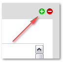

.. _functions:


Functions
=========

The "functions" section houses pages that provide more detailed information about individual functions of Wolf CMS. These pages serve as an additional source of information on top of the PHPDoc references. These function pages may be out of date since they are manually maintained. 

.. _author():

author()
--------

Wolf saves the id of the user who creates a page, and the name for that id can be displayed using author(). This is commonly given in the page's “meta”, for example: 

.. code-block:: php

	<p class="meta">Posted by <?php echo $this->author(); ?></p>
	
See also the :ref:`updater()` function.

.. _authorId():

authorId()
----------

Wolf saves the unique id number of the user who creates a page, and that id number can be accessed using authorId(). This might be especially useful if two "authors" registered on the system have the same name. For example:

.. code-block:: php

	<?php if ($this->authorId() == '1') {
		// do things
		} else {
		// do something else
		}
	?>

would be a more reliable test than one using the author() function (which returns the name) if two users were both registered with same name.

There is also a :ref:`updaterId()` function available.

.. _breadcrumb:

breadcrumb()
------------

When a page is created in Wolf, the “Breadcrumb” value is automatically completed with the same values as the page title itself. This is the page reference used automatically by the breadcrumbs function, but it can also be used on its own:

.. code-block:: php

	<?php echo $this->breadcrumb(); ?>

The "Breadcrumb" field is found under the "Metadata" tab next to the "Page Title" tab, and the value can be edited. [#f1]_ It may be, for example, that a very long page title could be abbreviated for use as a "breadcrumb". Once edited, and different from the Page Title, its value will remain unchanged even if the Page Title itself is changed.

.. [#f1] 
	
	It can be used, then, as a secondary “page title” field.

.. _breadcrumbs():

breadcrumbs()
-------------

"breadcrumbs" can be created in Wolf by adding this code to a Layout:

.. code-block:: php
	
	<?php echo $this->breadcrumbs(); ?>

By default, it produces output of this kind:

*Home > Music > Baroque > Bach*

In order to change the value of the separator, include it as a parameter. If for example, you wish to use a forward slash:

.. code-block:: php

	<?php echo $this->breadcrumbs('/'); ?>

Any character may be used this way.

.. note::   if you wish to use a backslash, it must be given twice, since it is a PHP escape character: 

.. code-block:: php

	<?php echo $this->breadcrumbs('\\'); ?> 

.. _children():

children()
----------

``children()`` returns an array of values relating to the child pages of the current page. [#f2]_ Normally, then, it is not used on its own, but to give some information about published subpages to a given page.

The array produced by ``children()`` requires a foreach loop to present usable information. The most simple listing of subpage titles, then, could look like this:

.. code-block:: php

	<h3>List of pages</h3>
	 
	<ul>
		<?php  foreach ($this->children() as $child) : ?>
		<li><?php echo $child->title(); ?></li>
		<?php endforeach; ?>
	</ul>

In situations when in return only a single result is desired, the foreach loop should be ditched in favor of limit ⇒ 1 argument (see Arguments below in this page), otherwise it will not work and a fatal error is returned instead. The example below returns the last published page from Articles as the parent page.

.. code-block:: php

	<?php 
	  $page_article = $this->find('/articles/');
	  $last_article = $page_article->children(array('limit'=>1, 'order'=>'page.created_on DESC')); 
	?>
		<h2 class="post_title"><?php echo $last_article->link(); ?></h2>
		<?php echo $last_article->content(); ?>
		<?php if ($last_article->hasContent('extended')) echo $last_article->link('Continue Reading&#8230;'); ?>

For further information on how to use ``children()`` in constructing menus, see how to Display a list of subpages. 

Conditions
++++++++++

Including hidden pages
``````````````````````

By default, ``children()`` only returns "published" pages. [#f3]_ In the following line of code, the final 'true' tells Wolf to include hidden pages as well:

.. code-block:: php

	$this->children(null,array(),true)


Additional arguments
````````````````````

Four more arguments can be given to ``children()`` to further define the subpages it returns: 

* where - sets a condition
* order - determines the sort order (by field name in page table [see note below], either ASC ascending, or DESC descending)
* offset - where in the list of subpages to begin the list
* limit - how many pages to return

A note on "order"
`````````````````

Any of the fields in the page table can be used to sort your "children" pages. In first example, below, you could have:

*'order' => 'title ASC'*

to arrange the order by the page Title in A-Z order, or

*'order' => 'slug DESC'*

to order the list by “slug” value in Z-A order. That should give you the idea! While any value in the “page” table could be used here, the main options would include:

* title
* slug
* breadcrumb
* created_on
* published_on
* updated_on
* created_by_id
* updated_by_id

The default is *position*, which is set automatically when the drag-drop page re-ordering is used.

	
	
.. [#f2]

	Consult the documentation on :ref:`$this->` to find out what the “current” page is in different situations.
	
.. [#f3]

	Consult the documentation on creating a page for a full list of page-status definitions.

.. _childrenCount():
	
childrenCount()
---------------

The ``childrenCount()`` function returns a count of how many child pages belong to the current page. A simple ``echo $this->childrenCount();`` will return the number of “published” pages to the current page.

``childrenCount()`` can be useful, then, for determining when to include navigation, for example: 

.. code-block:: php

	<?php if ($this->childrenCount() > 0) {
			// if count is > 0, there are child pages, so do stuff
		} else {
			// no child pages, so do something else
		}
	?>

It takes the same parameters as the :ref:`children()` function; see the above for details. 

.. _children():

content()
---------

As its name suggests, the ``content()`` function returns the content of pages created in Wolf. More specifically, it returns the content of the page-part given as a parameter; if no parameter is given, then it defaults to the body page-part, circled in red in this graphic: 

.. image:: ../images/content_tabs.png

In order to display the body, put this code at the appropriate place in your layout:

.. code-block:: php

	<?php echo $this->content(); ?>

Other content parts (page-parts) can be created by clicking the green "+" icon above the upper-right corner of the page editing box. (The red "-" icon deletes the active part/tab, so be careful!)



If you need to display one of these "custom" parts, like the sidebar tab in the Home Page graphic above (circled in blue), just add it to the parameter: 

.. code-block:: php

	<?php echo $this->content('sidebar'); ?>

.. note:: Note: if you use ``<?php echo $this->content(); ?>`` in page content, it will create an infinite loop: so don’t do it! In other words, only use that code for the page body tab in a Layout, not in a Page.

"Inheriting" content
++++++++++++++++++++

In order for the “part” to be inherited by "child" pages (and "child-of-child" pages, etc.), use the true parameter: 

.. code-block:: php

	<?php $this->content('sidebar', true); ?>

.. note: If the current page has its own equivalent "sidebar" part, then that will prevent the “inheritance” from the parent page from taking place. 

Displaying the content of one page on a different page
++++++++++++++++++++++++++++++++++++++++++++++++++++++

If you want to call the content from a some page onto a different page, you must use the :ref:`find()` function in conjunction with :ref:`content()`. For example, to display the content of the default “About us” page on any other page, use this code:

.. code-block:: php

	<?php echo $this->find('about_us')->content(); ?>

.. _date():	

date()
------

To display the date a page was created, use:

.. code-block:: php

	<?php echo $this->date(); ?>
	
If you want to change the format of the date, you can pass it as the first parameter of the method like this:

.. code-block:: php

	<?php echo $this->date('%A, %e %B %Y'); ?>
	
For more information about the date format, check the PHP manual for *strftime* http://php.net/strftime

.. note:: On Windows, and rarely in other settings, the use of %e may prevent any date appearing! In this case, use %d in its place. (See PHP Bugs for more information, the date howto for a work-around.) 

Values
++++++

The default date returned is the page’s creation date. The dates which can be displayed are:

* created — (default) which returns the date the page was initially stored in the database, no matter what "Status" it had;
* published — which returns the date the page was first saved with the “Status” set to "Published"; and
* updated — which returns the most recent date on which that page was altered (this can include re-ordering)

Example
+++++++

For example, if you want to display the last updated time of this page, use this: 

.. code-block:: php

	<?php echo $this->date('%a, %e %b %Y', 'updated'); ?>
	
How to translate every date in your layout
++++++++++++++++++++++++++++++++++++++++++

Set the locale to your language with the *setlocale* PHP function: 

.. code-block:: php

	<?php setlocale(LC_ALL, 'fr_CA.utf8'); ?>
	
For more information about this function, consult the PHP manual on *setlocale*  http://php.net/setlocale

.. _description():

description()
-------------

In editing a page, under the **Metadata** tab is the “Description” field which makes use of the ``description()`` function. The default Layout includes this line in the ``<head>…</head>`` section: 

.. code-block:: php

	  <meta name="description" content="<?php echo ($this->description() != '') ? $this->description() : 'Default description goes here'; ?>" />
	
This checks to see if there is any Metadata filled in for the page, and if there is, it is used. Otherwise, the default text is used. 

.. _executionTime():

executionTime()
---------------

The ``executionTime()`` function returns the time in seconds it takes for the page to be rendered. It can be called this way:

.. code-block:: php

	<?php echo $this->executionTime(); ?>
	
When **DEBUG** is defined as **true** in ``config.php``, this information is also reported in the footer of the admin pages.

.. _find():

find()
------

The ``find()`` function can be used to find and retrieve Page objects. As such, it needs a value to search on, either a **slug** value or a variable. It returns a Page object which has further functions to retrieve page information (or an array of information, depending on which of the object's function you use). A simple example: 

.. code-block:: php

	<?php
		$pageobject = $this->find('/about-us');
		echo $pageobject->link();
	?>
	
You can also directly access the object's (in this case) ``link()`` function with a short hand notation. This prevents you from first having to assign the result of the ``find()`` function to a variable before accessing the object's functions. A simple example: 

.. code-block:: php

	<?php echo $this->find('/about-us')->link(); ?>
	
These two examples are functionally the same and produce the following HTML from anywhere in the site:

.. code-block:: html

	<a href="http://www.mywolfsite.com/about_us">About us</a>
	
For the **main** level of navigation, ``find()`` does not need forward-slashes. All of these will produce the same result:

* $this->find('/about-us')
* $this->find('/about-us/')
* $this->find('about-us')

``find()`` can be used in conjunction with most (probably all!) of Wolf's other functions, not just "link", as in the example above.

Examples
++++++++

Finding pages at Level 2
````````````````````````

When looking for child-of-child pages *(That is, pages at level “2”; see the ``level()`` documentation for explanations of levels)*, both terms need to be given:

* **hard** set: ``$this->find('fruit/apples');``
* using variables: ``$this->find($parent.'/'.$subpage);``

Note that the ``getUri()`` function gives all slugs for a page, including the slugs of all ancestor pages.

Using variables
```````````````

The value of the search term can be contained in a variable. For example, the conditional navigation in the “Wolf” default layout finds a variable, $parent, which is the current top-level navigation page. Using this value in conjunction with the "children" function produces a dynamic listing of child-pages, giving a simple menu:

.. code-block:: php

	<?php // simplified code:
		$topPage = $this->find($parent);
	?>
	 
	<ul>
	<?php foreach ($topPage->children() as $subPage) : ?>
		<li><?php echo $subPage->link(); ?></li>
	<?php endforeach; ?>
	</ul>
	
.. _findById():

findById()
----------

The ``findById()`` function allows you to retrieve a set of page objects using a page's id as the search term. *(See the :ref:`id()` documentation on how to find the ID of any given page.)* This function works in the same way as the :ref:`find()` function; consult its entry for more discussion. 

**See also:** :ref:`linkById()` and :ref:`urlById()` gives information about using a variable for the ID.

Example
+++++++

You can use the id of page to construct a basic menu of child pages. This can be helpful in cases where the slugs or location of a parent page might change (“4” is the id of the “articles” page in a default installation of Wolf): 

.. code-block:: php

	<?php $children = $this->findById(4)->children(); ?>
	<ul>
	  <?php foreach ($children as $child) : ?>
	  <li><?php echo $child->link(); ?></li>
	  <?php endforeach; ?>
	</ul>
	
.. _getUri():

getUri()
--------

This function will return the **slug values** which point to a given page. 

Notes
+++++

For this code: ``<?php echo $this->getUri(); ?>``, note the different results:

    1. for URL: ``http://www.wolfsite.com/``
        * ``getUri()`` = [nothing]
    2. for URL: ``http://www.mysite.com/wolf/`` (when installing Wolf CMS in a subdirectory 'wolf')
        * ``getUri()`` = [nothing]``
    3. for URL: ``http://www.wolfsite.com/about_us``
        * ``getUri()`` = about_us
    4. for URL: ``http://www.wolfsite.com/about_us.html``
        * ``getUri()`` = about_us
    5. for URL: ``http://www.wolfsite.com/articles/2009/11/10/my_first_article``
        * ``getUri()`` = articles/my_first_article

Note in the last example that only the **slug** values are given, not the **yyyy/mm/dd** values generated by the **Archive plugin**. For this page behaviour, compare the related "constant", CURRENT_URI.

Examples
++++++++

Finding "top slug" for page tree
````````````````````````````````

It is often useful to find the slug of the top (level 1) page in a tree. This can be using for conditional navigation, or setting a unique background or banner for that area of the site, etc. The most simple code for this can use the ``getUri()`` function: 

.. code-block:: php
	<?php
		// Returns the top parent slug:
		$topParent = reset(explode('/', $this->getUri()));
	?>
	
For the URI of ``fruit/apples/granny-smith`` with the code above, then ``echo $topParent;`` would return ``fruit``. 

Get list of "sibling" pages
```````````````````````````

If one wanted a list of “sibling” pages (at same level, with same parent), you wouldn't know in advance how many slugs were needed in the find-> statement, so here again ``getUri()`` should be used. The following code (to be used in a Layout) produces a simple sibling list of this kind: 

* Sibling1
* Sibling2
* Sibling3

.. code-block:: php

	<?php if ($this->level() > 0) : ?>
	<ul>
	<?php foreach ($this->find($this->parent->getUri())->children() as $sibling) : ?>
		<?php if ($this->slug() != $sibling->slug()) : ?>
	<li><?php echo $sibling->link(); ?></li>
		<?php endif; ?>
	<?php endforeach; ?>
	</ul>
	<?php endif; ?>
	
.. note:: Note that the code as given omits the current page. To include all sibling pages, including the current page, remove the “inner” if/endif statements (lines 4 and 6). 

.. _hasContent:

hasContent()
------------

The ``hasContent()`` function may be thought of as the conditional counterpart of the ``content()`` function *(See the :ref:`content` function entry for fuller explanation.)*

It can take two parameters:

* A page-part must given as the first parameter. If it is found, the function returns **true**, otherwise it returns **false**.
* Like ``content()``, the ``hasContent()`` function can also be inherited by setting the second parameter to **true** (optional); by default this is set to **false**.

Examples
++++++++

Again, like ``content()``, this function relates to a given object, and so is used like this:

.. code-block:: php

	<?php echo $this->hasContent('page-part') ? $this->content('page-part'): ''; ?>

For the page-part to be inherited by all descendant pages, use:

.. code-block:: php

	<?php echo $this->hasContent('page-part') ? $this->content('page-part', true): ''; ?>

Version notes
+++++++++++++

< 0.6.0
```````

In versions up to and including 0.6, the name does not quite match the operation of this function: it does not test to see if “page-part” has any content, and then echoes it if there is some text there. Rather, it checks to see if there is a “page-part”, and then echoes whatever is there.

In other words, this function tests to see if a part exists, and will return “true” even if the part is there with no content at all.

0.7.0+
``````

With the introduction of the :ref:`partExists()` function, ``hasContent()`` now behaves as expected by the name: it checks to see if the part exists and if that part contains any content.

.. _id():

id()
----

The ``id()`` function returns the database ID of the current page. This code:

.. code-block:: php

	<?php echo $this->id(); ?>

will return a number, e.g. “1” for the root page (“Home page”) created at install time. 

.. note:: Note that for Archive pages, (e.g., the %B %Y archive monthly archive page created during installation), the ``id()`` result will be the same no matter which month (in this example) is being displayed, since each one is the same “page”. 

Finding the ID of a page
++++++++++++++++++++++++

To discover the ID of any page (“68” in the examples below), either *(a)* hover over the title in the Pages index, and the page id and slug will be displayed in a tooltip: 

.. image:: ../images/pageid_tooltip.png

or *(b)* click the **Settings** tab when editing the page:

.. image:: ../images/pageid_settings.png

See also
````````

The following functions also make use of the *id value* of a page:

* :ref:`findById()`
* :ref:`linkById()`
* :ref:`urlById()`

.. _includeSnippet():

includeSnippet()
----------------

This function is used to include **snippets** in Wolf pages. The syntax is:

.. code-block:: php

	<?php $this->includeSnippet('the_name_of_the_snippet'); ?>

On the way the special PHP variable ``$this->`` behaves when used in a snippet, see the documentation for ``$this->``.

Snippets may call/include other snippets.

From **0.7.0** the ``includeSnippet()`` function will return **true** if the snippet name is found, but **false** if the snippet name does not exist. If a test is used which evaluates ``includeSnippet()`` as **true**, the value of the snippet will be passed automatically.

Hints
+++++

Conditional Use of Snippets
```````````````````````````

You could also create a snippet with your php code, then only include it on the relevant page by using a conditional statement. That way you won't need a page-part, and it's only a small addition to your layout: 

.. code-block:: php

	<?php // only include on contact page or children
		if(url_start_with('/contact'))  $this->includeSnippet('the_name_of_the_snippet'); 
	?>
	
Just keep in mind that it will also be included in any children pages, because it's looking for a url that begins with the provided text. 

.. _keywords():

keywords()
----------

In editing a page, under the Metadata tab is the “Keywords” field which makes use of the keywords function. The default Layout includes this line in the ``<head>…</head>`` section:

.. code-block:: html

	<meta name="keywords" content="<?php echo ($this->keywords() != '') ? $this->keywords() : 'default, keywords, here'; ?>" />

This checks to see if there are any keywords filled in for the page, and if there are, they are used. Otherwise, the default text is used.

.. _level():

level()
-------

``level()`` refers to the “distance” of a page in the tree from Home Page or, more precisely, the number of elements a given page is distant from the “root” in the URI. “Home Page” (or “root” in the URI) is at zero.

You can echo the level of a page to the screen using this code:

.. code-block:: php

	<?php echo $this->level(); ?>

Examples
++++++++

.. list-table::
   :header-rows: 1
   
	* 
	 - In this URI
	 - this page:
	 - is at this level
	*
	 - http://www.wolfsite.com/
	 - (home page) 	
	 - 0
	*
	 - http://www.site.com/wolf/
	 - (home page) 	
	 - 0
	*
	 - http://www.wolfsite.com/about-us.html
	 - about-us.html
	 - 1
	*
	 - http://www.wolfsite.com/about-us/contact
	 - contact
	 - 2

It is **important to note** that the “archive” (“blog”) type pages work this way:


.. list-table::
   :header-rows: 1
   
	*
	 - In this URI:
	 - this page:
	 - is at this level:
	*
	 - http://www.wolfsite.com/articles
	 - articles
	 - 1
	*
	 - http://www.wolfsite.com/articles/2009/03/07/my-news
	 - my-news
	 - 5
	*
	 - http://www.wolfsite.com/articles/my-news
	 - my-news
	 - 5

.. note::: In an “archive” setting, the level of my-news is always 5, even though it is the child of the articles page which is at level 1.

Usage note
``````````

``level()`` is very useful in a test to keep things off the “Homepage” that should only appear “inside” the site:

.. code-block:: php

	<?php if ($this->level() != 0) : ?>
	... do stuff inside the site, but not on the Homepage ...
	<?php endif; ?>

The ``if()`` test checks to see if the level is **not** '0' (= homepage), and if not, whatever appears before the ``endif`` will be run.

.. _link():

link()
------

The ``link()`` function by default produces the title of the current page wrapped in HTML hyperlink tags For example, in an out-of-the-box Wolf install, for the “About Us” page, this code:

.. code-block:: php

	<?php echo $this->link(); ?>

produces:

.. code-block:: html

	<a href="http://www.mywolfsite.com/about_us">About us</a>
	
Arguments
+++++++++

``link()`` can take two arguments: the first to give the title for the link (so overriding the default page title), the second can be used for other link parameters.

See also: :ref:`linkById()`


